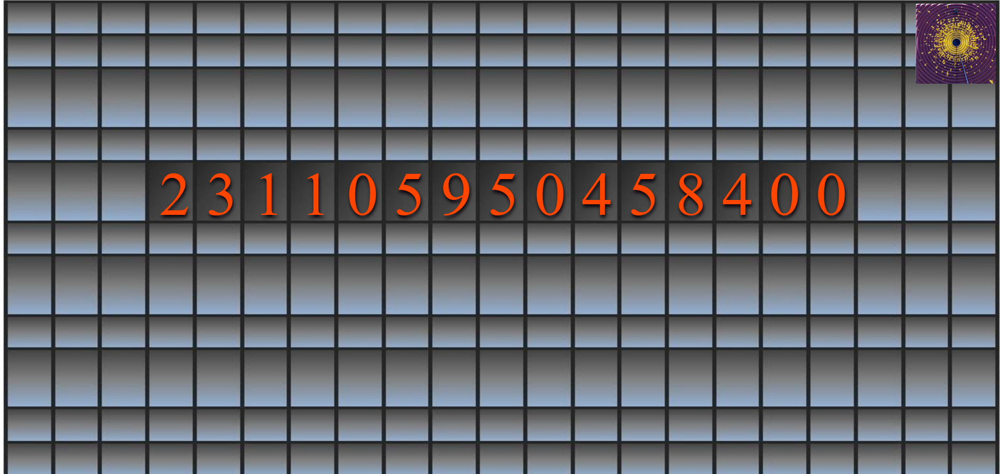

# MetronomeClock
Link to Live Site: https://chrisgrindereng.github.io/Metronome-Clock/

### Technologies, Frameworks and Programming Languages:
JavaScript, CSS, HTML

### Overview of Project:
- The metronome Clock at Union Square in NYC has often fascinated tourists and locals alike with its mysterious 15 different numbers, some of which count up while others count down. The basic explanation is that the first 8 numbers of the clock display in military time starting with hours and ending with centi-seconds (hh:mm:ss:d:c). The other side of the clock shows the time remaining till midnight and those counts down as the other side counts up, starting with deci-seconds and up to hours (d:ss:mm:hh). The fifteen numbers on the clock thus add up to 24 hours in a day. 

- To learn more, check out the wiki:  https://en.wikipedia.org/wiki/Metronome_(public_artwork)

- I thought this clock would be a fun coding challenge to try and replicate while practicing JavaScript. 

###Challenges Faced & Solutions Used: 

The biggest challenge I faced was setting up count down function of the clock. Solving this came down to selecting which of the many different date and time functions that exist in JavaScript. Ultimately I decided to use new Date() so I could apply the simple time functions like getHours() and then simply perform the proper mathematical operation on to return the time I needed.  

### Error Handling and Troubleshooting:
Much of the testing for this app was done through testing functions in JSFiddle before integrating them into my application. 

I also used developer tools in chrome to do some trouble shooting of JavaScript by viewing errors logged in the console. 

### MVP(Minimum Viable Product)
- Create a web application that works like the Metronome Clock. 

### Stretch Goals
- Adding styling features. 

### Contribution we'd like to be added:
- Create a function for allowing the background to change color with the time change. 

- One half would get darker as it moves towards 24 while the other half would get lighter as time moves towards 00. 
